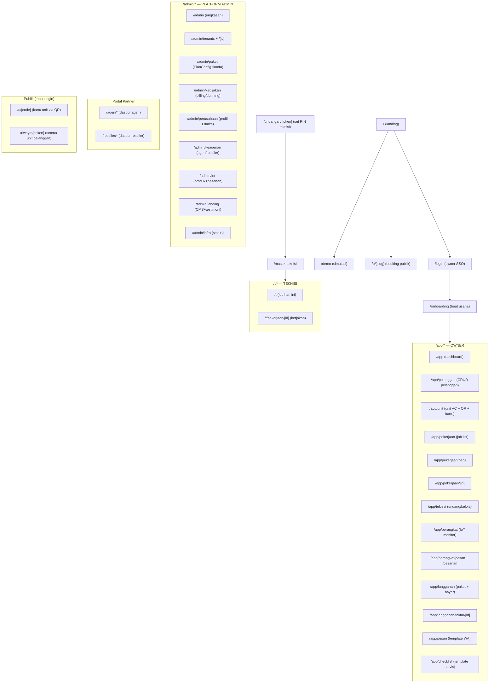
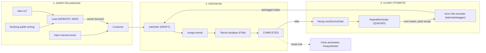
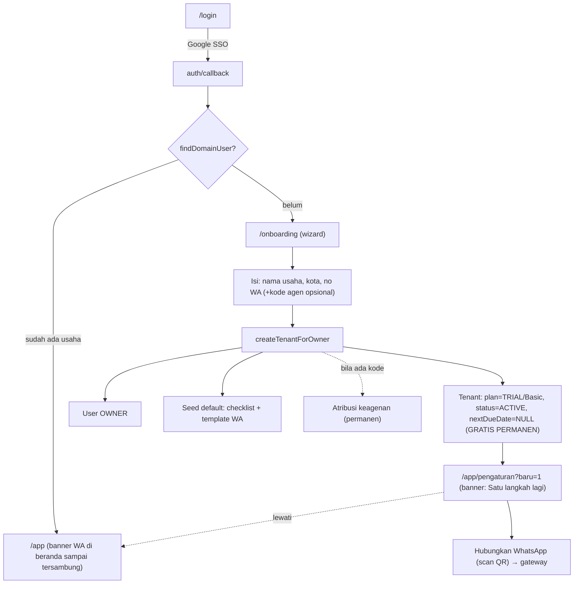
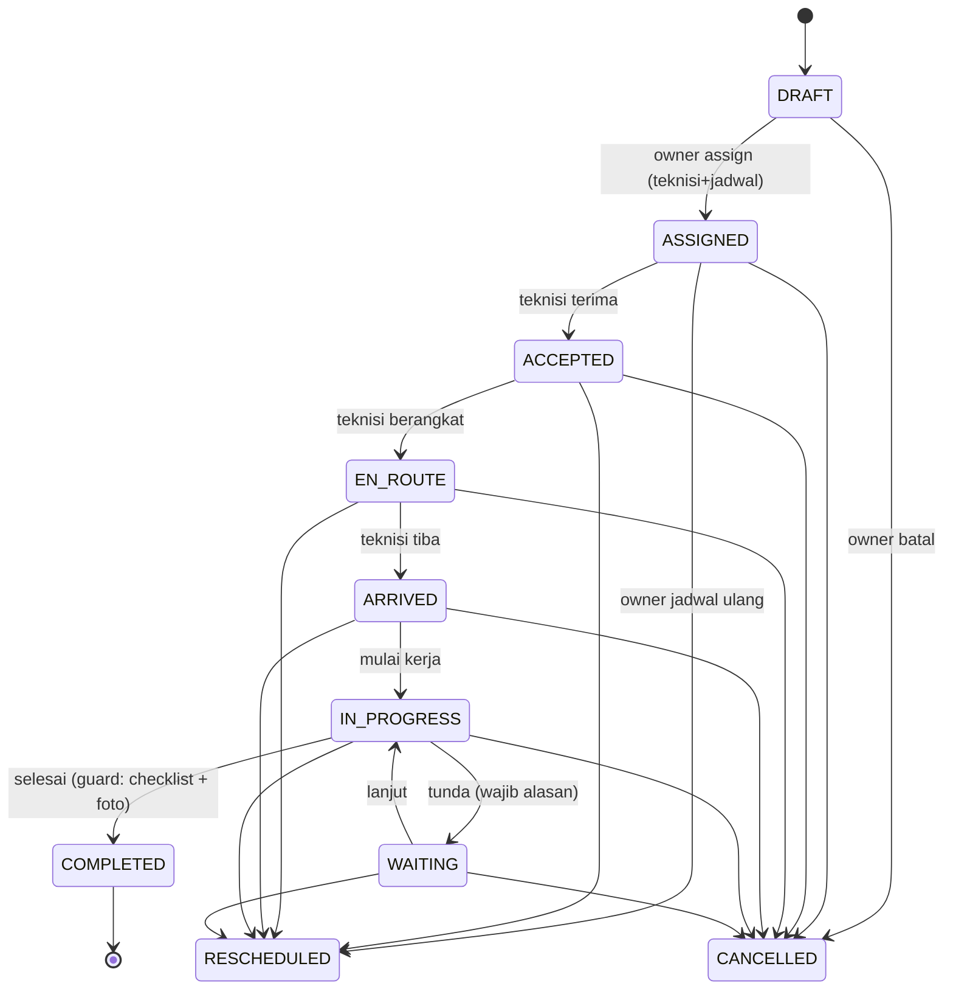
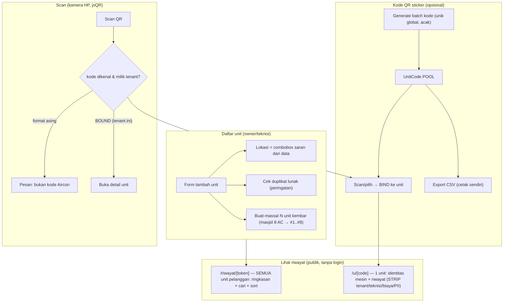
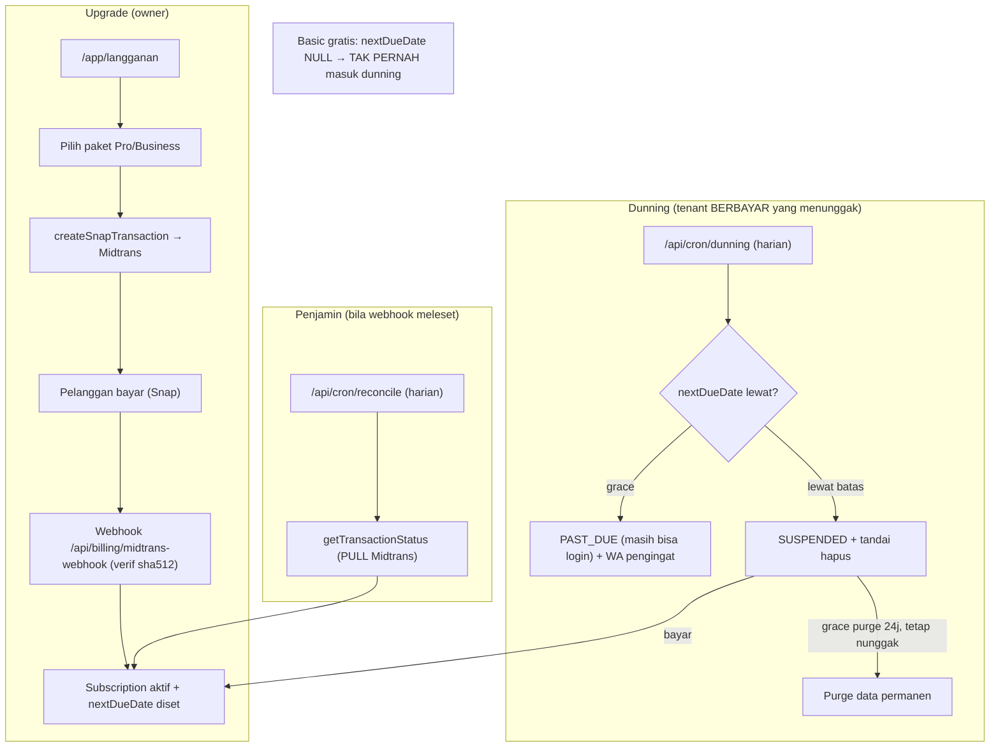
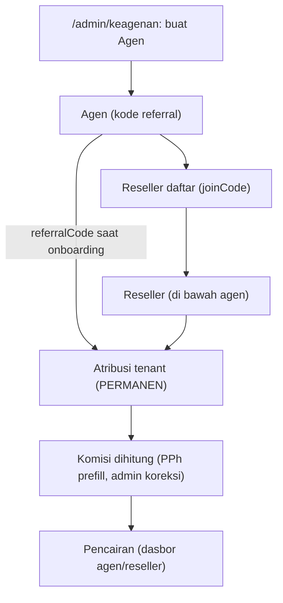
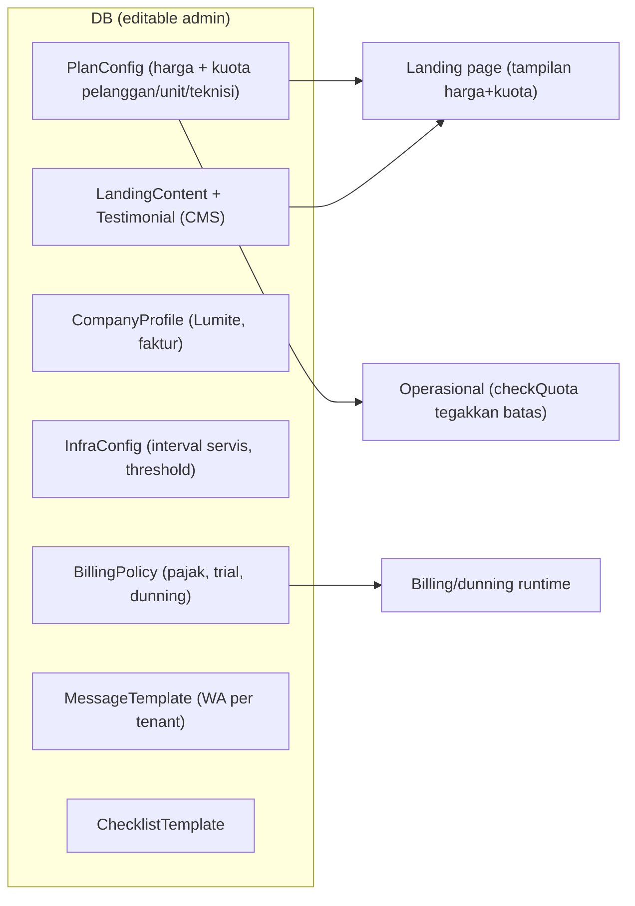
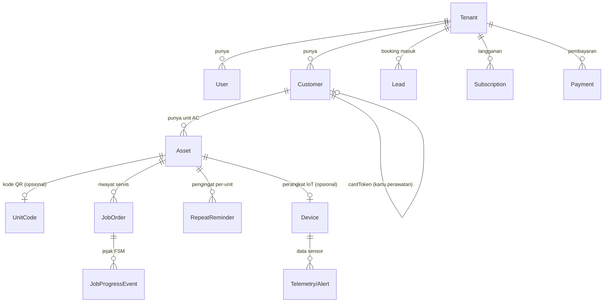

# Aircon — Diagram Alur Aplikasi (A–Z)

> Peta lengkap seluruh proses & fungsi, ditarik dari kode nyata (route, service, state machine).
> Diagram memakai **Mermaid** — dirender otomatis di GitHub, VS Code (ekstensi Mermaid), Obsidian, dll.
> Terakhir diperbarui: 28 Agu 2026.

---

## 0. Peta Aktor & Area

| Aktor | Cara masuk | Area |
|---|---|---|
| **Pemilik usaha (OWNER)** | Google SSO → `/login` | `/app/*` (dashboard tenant) |
| **Teknisi (TECHNICIAN)** | Phone + PIN → `/masuk-teknisi` | `/t/*` (mode lapangan) |
| **Admin Platform (Lumite)** | Google SSO + tabel PlatformAdmin | `/admin/*` |
| **Agen / Reseller** | Email/kode + PIN (cookie partner) | `/agen/*`, `/reseller/*` |
| **Pelanggan akhir** | Tanpa login (link/QR) | `/p/[slug]`, `/u/[code]`, `/riwayat/[token]` |

---

## 1. Peta Situs (semua route)

---

## 2. THE MONEY LOOP (proses inti — jantung produk)

> "Dapat pelanggan → kerjakan → selesai → otomatis mengingatkan → pelanggan datang lagi → berulang."

**Detail teknis money loop:**
- Booking → `createLeadFromBooking` (source=WEBSITE, status=NEW)
- COMPLETED → efek: `set_completed_at` + `compute_next_service_date` + `create_repeat_reminder` (+trigger review)
- Cron `/api/cron/reminders` (harian) → `runDueReminders` → **batch per pelanggan** (1 WA untuk banyak unit due) → `MessageLog` QUEUED → flusher → gateway WA VPS
- Interval servis default 90 hari (dari InfraConfig/tenant, editable)

---

## 3. Onboarding Tenant (daftar usaha baru)

**Kunci:** tenant baru = **Basic gratis selamanya** (ACTIVE, tanpa jatuh tempo → dunning tak menyentuh). Kuota (pelanggan/unit/teknisi) dari **PlanConfig** yang membatasi, diatur admin.

**Setelah daftar → hubungkan WhatsApp:** nomor WA di wizard hanya DISIMPAN (identitas usaha). Penautan asli ke gateway lewat **scan QR** di `/app/pengaturan`. Onboarding meng-redirect ke `/app/pengaturan?baru=1` (WaConnect tampil paling atas + banner sambutan). Bila dilewati, **banner beranda** (`WaConnectBanner`) mengingatkan sampai `gatewaySessionStatus().ready===true`. Bantuan in-app: topik help `onboarding` + `wa-connect`.

---

## 4. Job State Machine (FSM — alur kerja teknisi)

- **Guard COMPLETED:** semua item checklist required terisi + foto "after" (bila template minta).
- **Efek COMPLETED:** set completed_at, hitung next service date, buat RepeatReminder, picu permintaan ulasan.
- **Transisi tak terdaftar = ilegal (ditolak).** Role diperiksa tiap transisi (OWNER/ADMIN vs TECHNICIAN).

---

## 5. Identitas Unit AC + QR + Kartu Perawatan

- **Kode unik GLOBAL lintas tenant** (jangkar portabilitas atas-izin masa depan).
- **Halaman publik STRIP data sensitif** (tenant/teknisi/biaya/identitas pelanggan disembunyikan).
- **Kartu /riwayat/{token}** link statis-permanen; **otomatis tersisip di footer tiap WA reminder**.

---

## 6. Billing, Langganan & Dunning

- **Midtrans env-driven** (sandbox↔production 1 saklar `MIDTRANS_ENV`; PRODUCTION aktif).
- **Webhook + reconciler** = dua lapis penjamin (push + pull) karena akun Midtrans dipakai bersama beberapa app (X-Override-Notification).
- **Purge bertahap & reversible**: mark → grace 24 jam → purge (jendela bayar sebelum data hilang).

---

## 7. IoT (jual-putus + demand generator)

```mermaid
flowchart LR
  ORDER["Owner pesan perangkat /app/perangkat/pesan"] --> IOTORD["IotOrder"]
  IOTORD --> IWH["/api/billing/iot-webhook (bayar)"]
  IWH --> SHIP["Admin proses & kirim (/admin/iot)"]
  SHIP --> INSTALL["Terpasang di unit AC"]
  INSTALL --> INGEST["/api/iot/ingest (token) → telemetry"]
  INGEST --> DETECT["Deteksi anomali (threshold)"]
  DETECT --> ALERT["Alert → Peluang Servis"]
  ALERT --> LEAD["Jadi lead → money loop"]
```

---

## 8. Keagenan (F1/F2/F3 — pertumbuhan)

---

## 9. Endpoint Terjadwal & Webhook (ringkas)

| Endpoint | Pemicu | Fungsi | Proteksi |
|---|---|---|---|
| `/api/cron/reminders` | Cron harian | Kirim WA reminder due (batch/pelanggan) | `CRON_SECRET` |
| `/api/cron/dunning` | Cron harian | Siklus tunggakan + purge | `CRON_SECRET` |
| `/api/cron/reconcile` | Cron harian | PULL status Midtrans (penjamin) | `CRON_SECRET` |
| `/api/billing/midtrans-webhook` | Midtrans | Aktifkan langganan | sha512 signature |
| `/api/billing/iot-webhook` | Midtrans | Bayar perangkat IoT | signature |
| `/api/iot/ingest` | Perangkat IoT | Telemetry masuk | `IOT_BRIDGE_TOKEN` |
| `/api/wa/callback` `/api/wa/policy` | Gateway WA | Status/kebijakan WA | secret header |
| `/api/customers`, `/api/assets` (+`/[id]`) | App | CRUD (REST) | `requireApiContext` (sesi) |

> Cron di Vercel Hobby = **harian** (sub-harian merusak semua auto-deploy).

---

## 10. Konfigurasi Admin = 1 Sumber Kebenaran (no-hardcode)

**Prinsip:** angka/aturan bisnis TIDAK hardcode. Admin ubah di panel → berlaku serempak di **landing** DAN **operasional** (contoh: kuota pelanggan/unit tampil di landing = yang ditegakkan sistem).

---

## 11. Model Data Inti (relasi ringkas)

---

## Ringkas satu kalimat

**Pelanggan masuk** (booking/IoT/manual) → **jadi job** → **teknisi kerjakan lewat FSM** → **selesai memicu pengingat otomatis** → **WhatsApp menarik pelanggan kembali** → **berulang**; sementara **admin mengatur semua aturan** dari panel (satu sumber kebenaran), **billing** menagih tier berbayar (Basic gratis selamanya), dan **IoT + keagenan** menambah aliran pelanggan.
